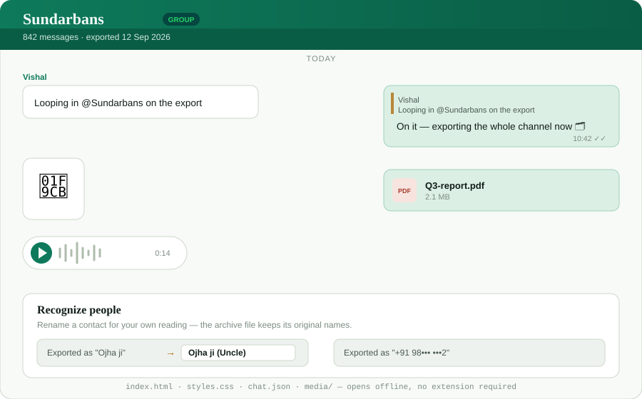
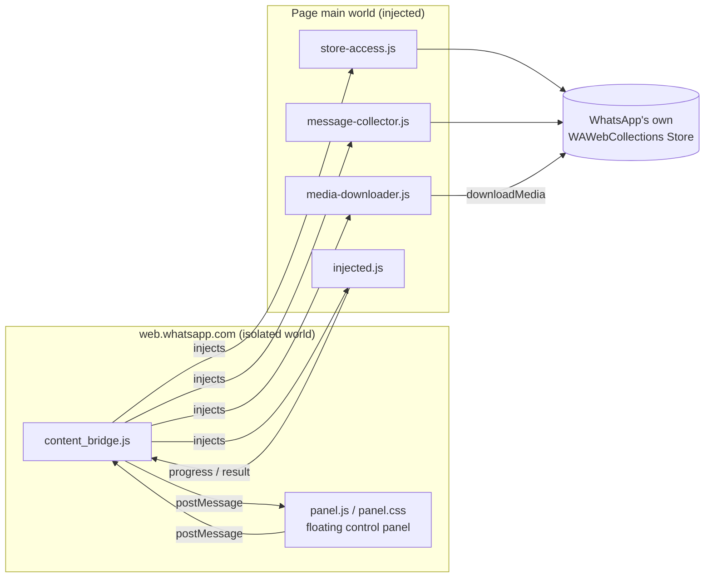
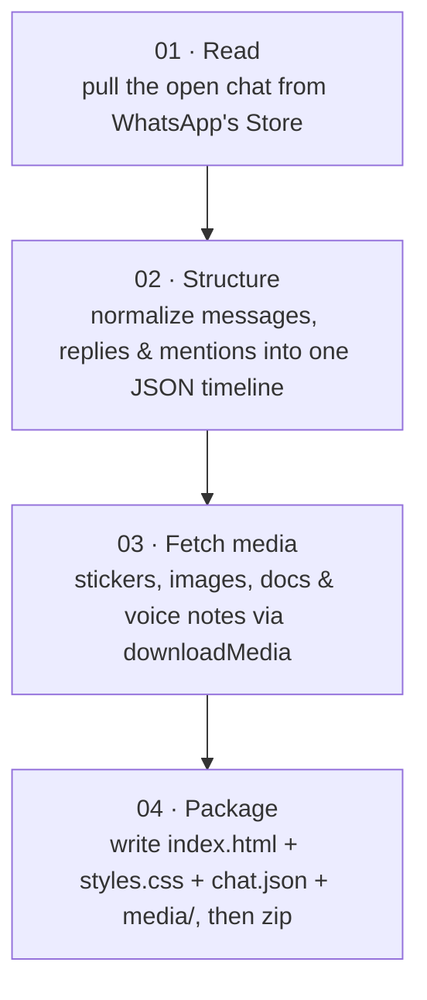

<div align="center">



<br>

[](manifest.json)
[](LICENSE)
[](#installation)
[](#installation)
[](#publishing-to-the-chrome-web-store--microsoft-edge-add-ons)

**Export the WhatsApp Web chat you have open into an offline, WhatsApp-styled HTML archive.**
Replies, stickers, images, documents and voice notes — kept the way WhatsApp showed them to you. No server. No upload.

</div>

---

## Contents

- [Why this works](#why-this-works)
- [What you get](#what-you-get)
- [Architecture](#architecture)
- [Project layout](#project-layout)
- [Installation](#installation)
- [Using the extension](#using-the-extension)
- [What's in the exported .zip](#whats-in-the-exported-zip)
- [Limitations](#limitations)
- [Privacy & permissions](#privacy--permissions)
- [Website](#website)
- [Publishing to the Chrome Web Store & Microsoft Edge Add-ons](#publishing-to-the-chrome-web-store--microsoft-edge-add-ons)
- [Versioning](#versioning)
- [License](#license)

---

## Why this works

It does **not** scrape the chat DOM. WA Rich Export injects a script into the WhatsApp Web **page's own main world** and reads already-decrypted messages straight out of WhatsApp's internal Store (`WAWebCollections` and related modules) — the exact same data the page has in memory to render what you're looking at. Media is fetched through WhatsApp's own `downloadMedia` path, the identical call the page makes when you open an image or play a voice note yourself.

That's also why the extension can get away with requesting almost nothing: one host permission, and nothing else.

## What you get

| Type | Support |
|---|---|
| Text, formatting (`*bold*`, `_italic_`, `~strike~`, `` `code` ``), links & emails | ✅ |
| Reply quote bars with click-to-jump to the original message | ✅ |
| Stickers | ✅ |
| Images | ✅ |
| Documents (as downloadable cards) | ✅ |
| Voice notes (as playable audio) | ✅ |
| Group sender names, @mentions, forwarded tags | ✅ |
| Temporary contact renaming at read-time (session-only; file keeps defaults) | ✅ |
| Light/dark panel that follows WhatsApp Web's own theme live | ✅ |
| Video | ⏳ placeholder in the same slot for now |
| History depth | Choose last 1,000 / last 5,000 / everything already synced |

<div align="center">

<br><sub>An illustration of the exported layout — not a live screenshot.</sub>
</div>

## Architecture





## Project layout

```
whatsapp-rich-export/
├── manifest.json                    # MV3 manifest — load this folder as "unpacked"
├── icons/                           # 16 / 48 / 128 px toolbar & store icons
├── docs/                            # README illustrations (this file only)
├── src/
│   ├── background/
│   │   └── service_worker.js        # minimal MV3 service worker
│   ├── content/
│   │   └── content_bridge.js        # injects the main-world scripts, boots the panel
│   ├── ui/
│   │   ├── panel.js                 # the floating control panel (drag, theme sync, progress)
│   │   └── panel.css
│   ├── injected/                    # run in the page's MAIN world
│   │   ├── store-access.js          # locates WhatsApp's internal Store modules
│   │   ├── message-collector.js     # walks + normalizes chat history
│   │   ├── media-downloader.js      # calls WhatsApp's own downloadMedia
│   │   └── injected.js              # message bus back to the content script
│   ├── export/
│   │   ├── renderer.js              # builds the WhatsApp-styled index.html
│   │   ├── whatsapp-theme.css.js    # the archive's own stylesheet
│   │   └── zip-builder.js           # packages + triggers the .zip download
│   └── lib/
│       └── jszip*.js                # bundled, used entirely offline
└── README.md
```

## Installation

WA Rich Export is currently distributed as source while the Chrome Web Store and Microsoft Edge Add-ons listings go through review (see [Publishing](#publishing-to-the-chrome-web-store--microsoft-edge-add-ons)). Both browsers are Chromium-based, so "load unpacked" works identically:

1. Clone or download this repository so you have a folder with `manifest.json` at its root.
   ```bash
   git clone https://github.com/itsMannuYadav/My-Whatsapp-Chat-Extension.git
   ```
2. Open `chrome://extensions` (Chrome) or `edge://extensions` (Edge).
3. Turn on **Developer mode** (top-right toggle in both browsers).
4. Click **Load unpacked** and select the cloned folder (the one containing `manifest.json`).
5. Open [https://web.whatsapp.com](https://web.whatsapp.com) and log in.
6. Open any chat — the **WA Rich Export** panel appears at the top-right.

Pulled newer code into the same folder later? Go back to the extensions page and click the refresh icon on the extension's card, then reload any open WhatsApp Web tab.

### Panel controls

- Drag the header to move the panel anywhere on screen — position is remembered.
- Click the minimize icon (or double-click the header) to tuck the panel into a floating button; click that button to bring it back.
- The **ⓘ** icon toggles the "what gets exported" hint.
- The panel automatically matches WhatsApp Web's light/dark theme.
- The status dot is amber while connecting, blue while an export is running, green when ready, red on error.

## Using the extension

1. Open the chat you want to keep.
2. Choose a history depth — last 1,000 / last 5,000 / everything already synced.
3. Click **Export chat**.
4. Wait through the four phases shown in the panel: load → structure → media → package.
5. Your browser downloads a `.zip` — unzip it and open `index.html` in any browser, any time, with no internet connection or extension required.

## What's in the exported .zip

```
ChatName_YYYY-MM-DD/
  index.html     # the WhatsApp-styled archive — open this
  styles.css
  chat.json      # the full normalized message timeline, if you want the raw data
  media/         # every image, sticker, document and voice note that was recovered
```

## Limitations

- Only messages **already synced to this WhatsApp Web session** can be exported — older history that lives solely on your phone isn't reachable from the browser tab.
- Media is best-effort: if WhatsApp hasn't cached decryptable bytes for a file, that message keeps a typed placeholder instead of a broken link.
- Video is a placeholder in the same slot, not yet a downloaded file.
- WhatsApp Web updates can rename its internal `WAWeb*` modules; the injector uses defensive fallbacks, but a large WhatsApp release can still require an update here.
- For your own chats only — keep exported archives private, the same way you'd treat the conversation itself.

## Privacy & permissions

WA Rich Export requests exactly **one** permission:

| Permission | Why |
|---|---|
| `host_permissions: https://web.whatsapp.com/*` | The only site the extension is allowed to run scripts on. |

That's it — no `storage`, no `tabs`, no broad `<all_urls>` host access, no analytics, no remote code. Everything the extension does happens locally in your browser; nothing it exports is ever transmitted to a server the developer controls, because there isn't one.

The full policy — including how the small set of local UI preferences (panel position, last-used history depth) are stored — lives on the [website](#website)'s privacy page.

## Website

A full marketing site — home, feature tour, an animated step-by-step demo, install guide, FAQ, and the privacy policy — lives in this repo under [`website/`](website/). It's a Next.js (App Router) app: shared header/nav/footer as real components, one global CSS file for the whole design system, no other runtime dependencies. See [`website/README.md`](website/README.md) for local dev commands.

The `/demo` page is worth a look on its own: a replayable, pixel-matched recreation of the whole export flow (WhatsApp Web, the real floating panel, the download, the archive) built entirely in CSS/SVG — no video file, no recording.

```
website/
├── app/
│   ├── layout.js        # fonts (next/font/google, self-hosted), <Header>/<Footer>
│   ├── globals.css        # the whole design system — tokens, components
│   ├── page.js             # home
│   ├── features/page.js
│   ├── demo/page.js         # animated, replayable walkthrough of the export flow
│   ├── install/page.js
│   ├── faq/page.js
│   ├── privacy/page.js       # ← the privacy policy URL the stores ask for
│   ├── not-found.js           # custom 404
│   └── icon.svg                 # favicon
├── components/
│   ├── Header.js         # nav + mobile menu ('use client')
│   ├── Footer.js
│   ├── ScrollReveal.js    # fade-in on scroll for .reveal elements
│   └── DemoWalkthrough.js # the /demo page's animated sequence
└── package.json
```

### Deploying to Vercel

**Option A — Vercel dashboard (recommended for a custom domain):**

1. Push this repo to GitHub (it already has the `itsMannuYadav/My-Whatsapp-Chat-Extension` remote configured).
2. On [vercel.com](https://vercel.com), **Add New… → Project**, and import this repository.
3. When configuring the project, set **Root Directory** to `website`. Vercel auto-detects Next.js — build command and output directory need no changes.
4. Click **Deploy**. Vercel gives you a `*.vercel.app` URL immediately.

**Option B — Vercel CLI:**

```bash
npm i -g vercel
cd website
npm install
vercel        # first run links/creates the project and deploys a preview
vercel --prod # promotes to your production URL
```

### Connecting your own domain

1. In the Vercel project, go to **Settings → Domains** and add your domain (e.g. `wa-rich-export.com`).
2. Vercel shows you the DNS record it needs:
   - Apex domain (`wa-rich-export.com`) → an **A** record to `76.76.21.21`, or use Vercel's nameservers.
   - Subdomain (`www.wa-rich-export.com`) → a **CNAME** record to `cname.vercel-dns.com`.
3. Add that record at your domain registrar (or DNS provider). Vercel verifies it automatically and issues an SSL certificate — usually within minutes.
4. Once it's live, put the real URL:
   - in the Chrome Web Store & Edge Add-ons listings as the **privacy policy URL** (`https://yourdomain.com/privacy`),
   - and, optionally, as `"homepage_url"` in `manifest.json`.

Every push to your GitHub repo's default branch redeploys the site automatically; other branches get their own preview URLs.

## Publishing to the Chrome Web Store & Microsoft Edge Add-ons

Both stores accept the same Manifest V3 package, so you build one `.zip` and submit it twice.

### 1 — Bump the version

Store submissions are rejected if you upload a package with a version already in use. Bump it first:

```jsonc
// manifest.json
"version": "1.1.0",
```

### 2 — Build the .zip

**The zip's root must contain `manifest.json` directly — not nested inside an extra folder.** Only include what the extension actually ships; leave out `README.md`, `docs/`, `.git`, and anything else that isn't runtime code.

PowerShell (Windows):

```powershell
Compress-Archive -Path manifest.json, icons, src -DestinationPath wa-rich-export.zip -Force
```

macOS / Linux:

```bash
zip -r wa-rich-export.zip manifest.json icons src
```

Sanity-check the result before uploading — `manifest.json` should be the first thing listed, not `wa-rich-export/manifest.json`:

```bash
unzip -l wa-rich-export.zip | head
```

### 3 — Chrome Web Store

1. Sign in to the [Chrome Web Store Developer Dashboard](https://chrome.google.com/webstore/devconsole) (a one-time **$5 USD** registration fee applies to your developer account, not per extension).
2. Click **New Item** and upload `wa-rich-export.zip`.
3. Fill in the store listing:
   - **Name / summary** (132 characters) / **description** — what it does, plainly.
   - **Category** — Productivity.
   - **Icon** — already bundled at `icons/icon128.png`.
   - **Screenshots** — 1280×800 or 640×400 px, 1–5 images. Show the panel open on a real chat and a snippet of the exported archive.
   - **Small promo tile** (440×280 px) — optional, recommended for discoverability.
4. Open the **Privacy practices** tab:
   - Justify the single host permission (`web.whatsapp.com`) in one sentence — it's the only site the extension needs to run on.
   - Declare that no user data is collected or transmitted (see [Privacy & permissions](#privacy--permissions)).
   - Link your **privacy policy URL** — the privacy page on your [website](#website).
5. Set **Distribution** (visibility, regions) and **Submit for review**. Review typically takes anywhere from a few hours to a few days.

### 4 — Microsoft Edge Add-ons

1. Sign in to [Microsoft Partner Center](https://partner.microsoft.com/dashboard/microsoftedge/overview) — free, no listing fee.
2. Create a **New extension** submission and upload the **same** `wa-rich-export.zip`; Edge accepts Chrome MV3 packages as-is.
3. Fill in the listing — description, category, screenshots (1280×800 recommended), support contact, and the same **privacy policy URL**.
4. Submit for **certification**. Microsoft runs an automated + manual review, typically within a few business days.

### Store asset checklist

| Asset | Chrome Web Store | Edge Add-ons |
|---|---|---|
| Icon | 128×128 (bundled) | 128×128 (bundled) |
| Screenshots | 1280×800 or 640×400, 1–5 | 1280×800 recommended |
| Small promo tile | 440×280 (optional) | not required |
| Privacy policy URL | required | required |
| Developer account cost | $5 one-time | free |

### 5 — Shipping an update later

Repeat steps 1–2 with a higher `version`, then re-upload the new `.zip` on each store's existing listing and submit for review again — both stores treat every upload as a fresh review, even for small fixes.

## Versioning

This project follows a simple `major.minor.patch` scheme in `manifest.json`. Bump `patch` for fixes, `minor` for new features, `major` for breaking changes to the export format (e.g. the `chat.json` shape).

## License

[MIT](LICENSE) — see the license file for the full text.

---

<sub>Independent project — not affiliated with, endorsed by, or associated with WhatsApp or Meta. WhatsApp is a trademark of WhatsApp LLC.</sub>
